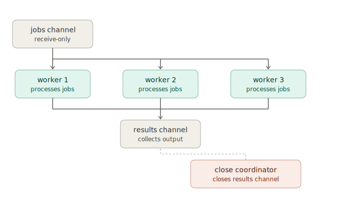

# Go concurrency: worker pool job processor (concept only)

## The question (as sent by colleague)

> Build a job processor: jobs come in on a channel, N workers process them, results go out on another channel. When the input channel is closed, workers finish in-flight jobs, then the results channel closes. No goroutine leaks, no panics on shutdown.

## The core idea: two channels, one fan-out / fan-in pattern

A channel in Go is a typed pipe. `jobs` is a pipe workers pull from, `results` is a pipe they push into. You start N goroutines (the workers), each looping over `jobs` and writing to `results`. That is the "fan-out" (one channel, many consumers) and "fan-in" (many producers, one channel) shown in the diagram below.

## Why closing the jobs channel is enough to stop the workers

Ranging over a channel is not just a loop, it is a listener. It keeps pulling values until the channel is both closed and drained. So the moment the input channel is closed, every worker finishes whatever job it is mid-processing, drains any buffered items still sitting in the channel, then falls out of the loop naturally and exits on its own. Nothing extra like a signal channel or a cancellation context is needed just to get this part right. This is exactly the behavior the question asks for: in-flight jobs finish before a worker stops.

## The tricky part: who is allowed to close the results channel?

This is where most first attempts break. The results channel cannot be closed by a worker, because there are multiple workers all writing to it at the same time. If one worker finishes its share of jobs first and closes the channel, any other worker that is still mid-send will try to write to a channel that is already closed. In Go, sending on a closed channel is a runtime panic, not a recoverable error, so this shuts the whole program down ungracefully.

The fix is coordination: track how many workers are still active, and only close the results channel once that count hits zero. `sync.WaitGroup` is the standard tool for this kind of "wait until N things are done" tracking. Each worker signals that it is finished when it exits its loop, and a single dedicated goroutine waits for all of those signals before closing the channel. That goroutine is the "close coordinator" shown in the diagram, and it is the only piece of code allowed to close that channel. Having exactly one owner for the close operation is what guarantees no panic.

## Why there is no goroutine leak

A leak happens when a goroutine is left blocked forever with nothing left in the program that could ever wake it up. In this design, every worker only ever blocks on receiving from the jobs channel, and that block resolves permanently once the jobs channel is closed. The coordinator only ever blocks on waiting for the workers to finish, and that resolves once every worker has actually returned. There is no goroutine left waiting on something that will never happen, which is what "no leaks" means in practice.

## The shape of the guarantee

Put together, the pattern gives you a clean lifecycle with no dangling pieces:

- Producer closes the jobs channel when there is no more work.
- Each worker drains whatever is left, then exits.
- The coordinator notices when the last worker has exited.
- The coordinator, and only the coordinator, closes the results channel.
- The consumer, which is ranging over results, sees the channel close and exits too.

Every stage waits on something that is guaranteed to eventually happen, so the whole pipeline shuts down cleanly instead of hanging or crashing.
